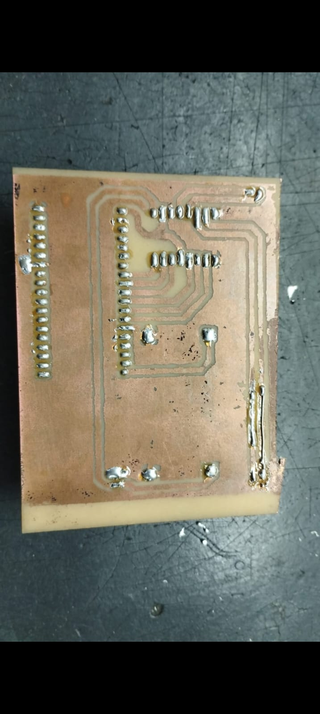
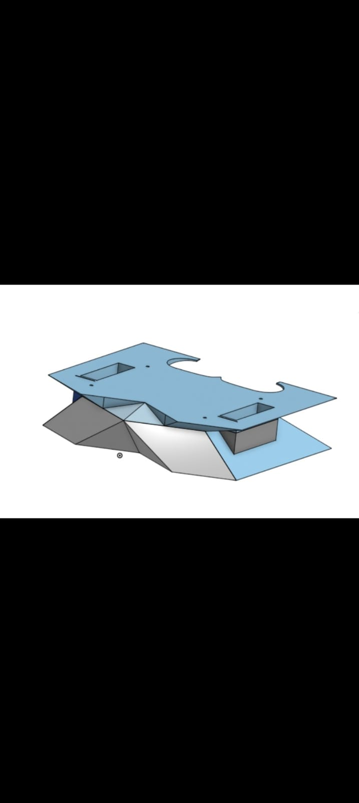
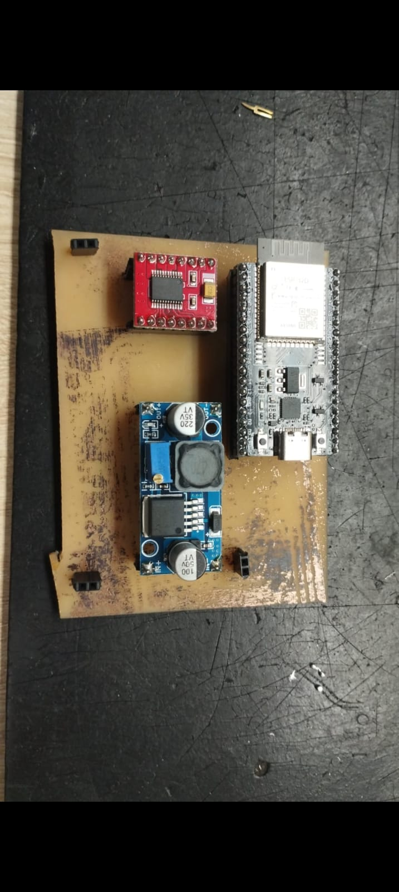

# Mini Hockey Robot

A small autonomous/remote-controlled Mini Hockey robot developed at GERM — UDESC.

The project combines mechanical design, PCB development, electronics,
embedded programming, and robot control.

## My Contributions

- PCB design using EasyEDA
- Electronic integration
- Embedded C/C++ programming
- Robot control logic
- Hardware/software integration

## Hardware

- **Microcontroller:** ESP32 (38-pin)
- **Motor driver:** TB6612FNG H-Bridge
- **Voltage regulator:** LM2596 DC-DC step-down converter
- **Motors:** 2× N20 DC motors
- **Battery:** 2× 3.7 V, 380 mAh

## PCB

[PCB image]

The custom PCB was designed using EasyEDA, including schematic and PCB layout.

## Mechanical Design

## Robot

The mechanical components were designed using AutoCAD.

## PCB

## Software

The ESP32 firmware establishes a Bluetooth connection and controls the
robot's movement. The robot can be operated remotely using a mobile phone.

## Demonstration

[Video/GIF]
https://github.com/FabioJCSeverino/MiniHockeyRobot/blob/77990c0c701ba8df134320fbdc53672d5605c783/MicroHoc.webm
